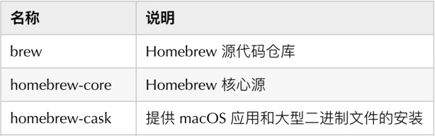

[TOC]

### 1. homebrew和gem
1. Homebrew简称brew，是Mac OSX上的软件包管理工具，能在Mac中方便的安装软件或者卸载软件。相当于Linux听的yum、apt-get等软件管理工具。
2. RubyGems简称gem，RubyGems是一个包管理框架，提供了ruby社区的gem的托管服务，用于ruby软件包的下载、安装、使用；ruby的软件包被称为gem，包含了ruby应用或库。和brew不同，brew用于操作系统层面上的软件包的安装，而gem只是管理ruby软件

### 2.  homebrew安装
gem是Mac自带的，但是homebrew如果要使用，需要自己安装。如果使用下面的安装方式，如果是在国内，且没有科学上网工具，那基本行不通。
```
/usr/bin/ruby -e "$(curl -fsSL https://raw.githubusercontent.com/Homebrew/install/master/install)"
```
应该可能大概会出现以下错误：
`error: RPC failed; curl 56 LibreSSL SSL_read: SSL_ERROR_SYSCALL, errno 54`
因此我们需要采用镜像的方式来安装。

#### 2.1 国内镜像安装

执行如下脚本

```
/usr/bin/ruby -e "$(curl -fsSL https://cdn.jsdelivr.net/gh/ineo6/homebrew-install/install)"
```
如果命令执行中卡在下面信息：
```
==> Tapping homebrew/core
Cloning into '/usr/local/Homebrew/Library/Taps/homebrew/homebrew-core'...
```
或者出现
```
fatal: unable to access 'https://github.com/Homebrew/homebrew-core/': LibreS
```
请Control + C中断脚本执行如下命令：
```
cd /usr/local/homebrew/Library/Taps/homebrew
```
没有上述路径请自行创建，然后使用中科院的镜像手动安装
```
git clone git://mirrors.ustc.edu.cn/homebrew-core.git/ /usr/local/Homebrew/Library/Taps/homebrew/homebrew-core --depth=1
```
brew cask是brew的extension，主要用来安装Mac OS的是 已经编译好了的应用包 （.dmg/.pkg），要是用的话，也是用国内镜源比较好：

```
cd /usr/local/homebrew/library/taps/homebrew
git clone git://mirrors.ustc.edu.cn/homebrew-cask.git/
```
这时，基本上已把homebrew的“brew" 装好了。可以试试：
```
brew --version
```
### 3. cocoapods
CocoaPods是一个用来管理第三方依赖库的工具。可以解决库与库之间的依赖关系，下载库的源代码，同时通过创建一个Xcode的workspace来将这些第三方库和我们的工程连接起来，供开发使用。
#### 3.1 cocoapods安装
打开Terminal终端，检测系统是否已经安装ruby
通常情况下都有自带ruby
```
ruby -v
```
sudo gem install cocoapods但这个会等很久，因为没有科学上网工具，
所以需要改变安装源。
1. 查看所有安装源：
```
gem sources -l
```
2. 改变安装源：
```
gem sources -remove https://rubygems.org/
gem sources -a https://gems.ruby-china.com
```
`注意：这里是https://gems.ruby-china.com，你可能遇到了bad response Not Found 404 (https://gems.ruby-china.org/specs.4.8.gz)问题，是因为镜像的域名已经由.org变为.com`
3. 安装CocoaPods:
```
sudo gem install cocoapods
```
如果遇到了
```
ERROR: Error installing cocoapods: ERROR: Failed to build gem native extension
```
你可以：
```
brew cleanup -d -v 
# 然后运行
brew install cocoapods 
```
4. 更新cocoapos版本（番外）

可以直接打开网址https://gems.ruby-china.com，搜索cocoapods，查看当前版本列表
更新至最新版：
```
gem install cocoapods -pre
```

更新至指定版本： 
```
gem install cocoapods -v 1.6.1
```
#### 3.2 cocoapods的简单使用
1. 搜索源是否存在
```
pod search masonry
```
2. 创建配置文件
```
vim podfile
```
3. 编辑配置文件
```
platform :ios,'8.0'   (平台版本)
use_frameworks!   (可有可无)
target 'your project name' do
pod 'Masonry','~>1.0.1'  （表示指定[1.0.1,1.1.1)区间内的版本号）
end
```
4. 集成相关类库
```
pod install
```
`如果卡在这里不动或报错，是因为在默认升级，但是没有科学上网工具。
那就用命令规避每次执行setup要更新spec仓库的操作：
pod install --verbose --no-repo-update
`