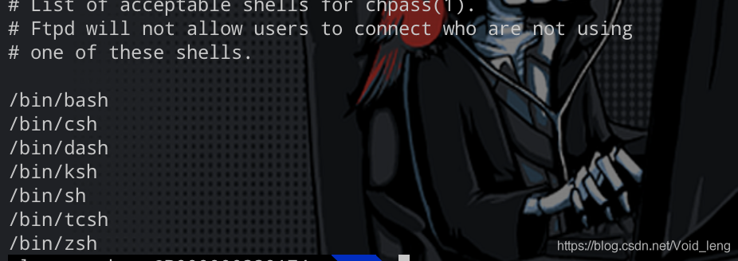
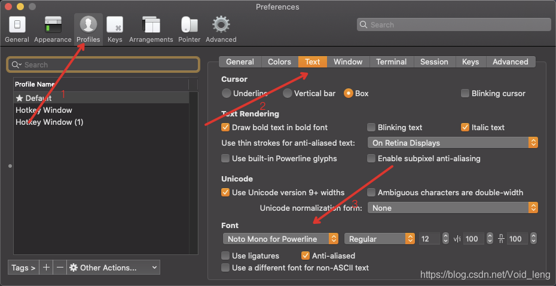

>换上了新电脑，环境都需要重新配一下。所以配一下自己的iterm2，顺便记录一下。
>
>[TOC]
#### 1. shell
shell是Linux操作系统的交互式工具。其核心就是命令行提示符。它允许输入文本命令，之后解释这些命令并在内核执行。
也可以将一组shell命令放在文件中作为可执行文件，这个文件就叫做shell脚本。
在Linux操作系统上，通常有好几种Linux shell可用。使用 `cat /etc/shells`查看所有shell。



| shell | 描述                                                         |
| ----- | ------------------------------------------------------------ |
| sh    | Bourne shell 是 UNIX 最初使用的 shell，并且在每种 UNIX 上都可以使用 |
| korn  | 兼容sh的编程shell，但支持高级编程特性                        |
| bash  | 在1987年由布莱恩·福克斯为了GNU计划而编写。1989年发布第一个正式版本，原先是计划用在GNU操作系统上，但能运行于大多数类Unix系统的操作系统之上，包括Linux与Mac OS X v10.4都将它作为默认shell。Bash是Bourne shell的后继兼容版本与开放源代码版本，它的名称来自Bourne shell（sh）的一个双关语（Bourne again / born again）：Bourne-Again SHell。 |
| tcsh  | Tcsh是csh的增强版，并且完全兼容csh。它不但具有csh的全部功能，还具有命令行编辑、拼写校正、可编程字符集、历史纪录、作业控制等功能，以及C语言风格的语法结构。 |
| zsh   | 引入bash，tcsh，korn的特性，同事提供高级编程特性，以及主题化提示符等 |
#### 2. zsh
这里以mbp为例。一般终端默认的Shell都是Bash，执行下列命令可以查看当前终端用的Shell类型

```
echo $SHELL
```
但是需要升级一下
```
brew install zsh
```
如果没有安装brew，请访问 【[如何安装homebrew，cocoapods](https://blog.csdn.net/Void_leng/article/details/108072425)】

然后安装Wget，一个从网络上自动下载文件的工具，支持通过 HTTP、HTTPS、FTP 三个最常见的 TCP/IP协议 下载，并可以使用 HTTP 代理。通过下列命令安装该工具
```
brew install wget
```
然后切换shell
```
chsh -s /usr/local/bin/zsh
```
切换之后需要退出终端重新打开，否则还是默认的shell。接下来安装主题。每一次配置主题都是心酸的，但是好在为了配置zsh开发了`Oh My Zsh`。
这里使用wegt工具自动安装

```
wget https://github.com/robbyrussell/oh-my-zsh/raw/master/tools/install.sh -O - | sh
```
切换回其他shell，主题就没了。
打开zsh配置文件`[～/.zshrc]`，修改`ZSH_THEME`字段信息为`agnoster`(默认值：`robbyrussell`) 由于部分主题使用了`Powerline`插件，这个时候会发现别人的都是箭头，但是你的是两个问号，这是因为我们还要安装 添加`Powerline `字体

```
git clone https://github.com/powerline/fonts.git
cd fonts
./install .sh
cd ..
rm -rf fonts
```
然后打开这个界面，按照图片的步骤，选择一个带有`powerline`的字体，箭头就出来了，到这里就配置完成了。如果需要换主题，只需要在`zshrc`的`ZSH_THEME`修改。然后`source`一下。

**（这个在preference或者在顶部的profiles --> open profiles --> Edit ）**




